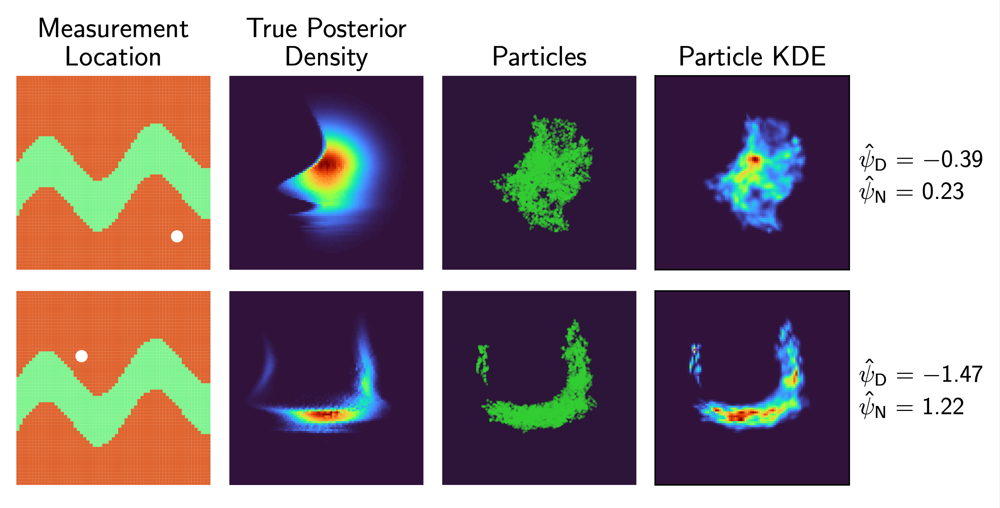

# Ensemble-Based Bayesian Optimal Experimental Design



This repository contains code used to demonstrate the application of ensemble methods to Bayesian optimal experimental design (OED) problems arising in geophysics.
As a test case, we use the problem of estimating the steady-state log-transmissivity distribution of an aquifer. We are provided with 64 possible locations at which we can measure.

The top level of the repository contains two scripts:
 - `run_oed_high_dim.jl` runs a high-dimensional test case (~7000 unknown parameters). Ensemble Kalman inversion [[1](#1), [2](#2)] is used, in combination with a greedy algorithm, with the aim of finding an optimal design with respect to the Bayesian A-optimality criterion.
 - `run_oed_low_dim.jl` runs a low-dimensional test case (two unknown parameters). An adaptation of the ensemble Kalman sampler [[3](#3), [4](#4)] with locally-weighted gradients developed by Reich and Weissman [[5](#5)] is used to approximate the expectation of Bayesian D-optimality criterion, and a criterion which measures the expected level of "Gaussianity" of the posterior, at each canidate measurement location. The figure at the top of this document shows some examples of candidate measurement locations, the true posterior and ensemble estimate of the posterior associated with a potential set of data, and the values of the D-optimality (``\hat{\psi}_{\mathrm{D}}``) and normality (``\hat{\psi}_{\mathrm{N}}``) criteria (in both cases, lower values are better).

## Getting Started

First, install Julia >= 1.9.0. 
Clone the repository, then create an environment with the project dependencies by running the following in the Julia REPL:
```
using Pkg
Pkg.activate(".")
Pkg.instantiate()
```
You can then run either of the scripts in the top level of the repository.

## References

[<a id="1">1</a>]
Iglesias, MA, Law, KJ, and Stuart, AM (2013).
Ensemble Kalman methods for inverse problems.
*Inverse Problems* **29**, 045001.

[<a id="2">2</a>]
Iglesias, M and Yang, Y (2021). 
Adaptive regularisation for ensemble Kalman inversion.
*Inverse Problems* **37**, 025008.

[<a id="3">3</a>]
Garbuno-Inigo, A, Hoffmann, F, Li, W, and Stuart, AM (2020).
Interacting Langevin diffusions: Gradient structure and ensemble Kalman sampler. 
*SIAM Journal on Applied Dynamical Systems* **19**, 412-441.

[<a id="4">4</a>]
Garbuno-Inigo, A, Nüsken, N, and Reich, S (2020). 
Affine invariant interacting Langevin dynamics for Bayesian inference. 
*SIAM Journal on Applied Dynamical Systems* **19**, 1633-1658.

[<a id="5">5</a>]
Reich, S and Weissmann, S (2021). 
Fokker–Planck particle systems for Bayesian inference: Computational approaches. 
*SIAM/ASA Journal on Uncertainty Quantification* **9**, 446-482.